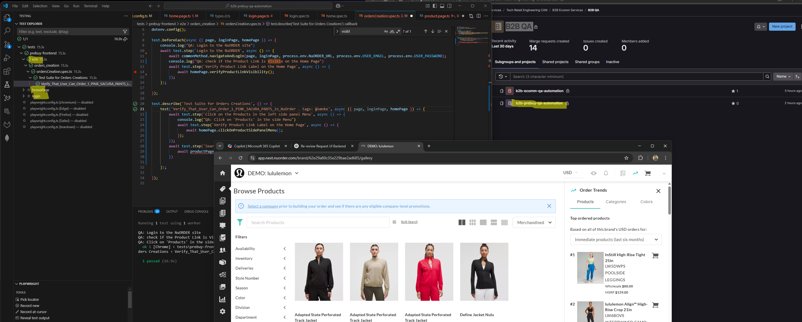

# LULULEMON PREBUY Franchise - QA Automation

## Page Object Model Pattern with Playwright




## Overview

This project is built using the **Page Object Model (POM)** design pattern for Smoke testing of the NuOrder E-commerce application. It also features extensive reporting with Playwright and Allure HTML reports.

## Project Structure

```
b2b-prebuy-qa-automation/
│
├── pageFactory/                 # Contains all Page Object files
│   └── prebuy/                     # NuOrder PreBuy-related page object files
│       ├── PREBUYBasePage.ts       # Common base helper functions
│       ├── home.page.ts         # Home page related test methods
│       └── login.page.ts
│
├── tests/                       # Contains all test files
│   └── prebuy/                     # B2B-related test scripts
│       ├── home.spec.ts         # Home page related test cases
│       └── login.spec.ts
│
├── utilities/                   # Common utilities
│   ├── PREBUYConstants.ts          # Static values and constants
│   └── PREBUYTestdata.ts           # Test data for various test cases
│
├── fixture/                     # Test fixtures to establish the test environment
│   └── PREBUYBaseTest.ts
│
├── .env                         # Environment variables
├── package.json                 # Node.js project metadata and dependencies
├── playwright.config.ts         # Playwright configuration file
└── README.md                    # Project overview (this file)
```

## Environment Setup

### Prerequisites
- GitLab access with clone and develop permissions
- IDE: **Visual Studio Code**
- Local Admin access

### Software Installation

#### Install Node.js
Download and install Node.js from:
```sh
https://nodejs.org/en/download/
```

#### Install Allure Command Line
Install Allure for generating test reports:
```sh
npm install -g allure-commandline
```

## Project Setup

### 1. Clone the Repository
```sh
git clone https://gitlab.com/lululemon/global-tech-services/tech-retail-engineering-can/b2b/b2b-qa/b2b-ecomm-qa-automation.git
```

### 2. Navigate to the Project Directory & Install Dependencies
```sh
cd b2b-prebuy-qa-automation
npm install
```

### 3. Install Required Browsers
```sh
npx playwright install
npx playwright install webkit
npx playwright install-deps
```

### 4. Install Python for TestRail Integration
Download and install Python 3 from:
```sh
https://www.python.org/downloads/release/python-3104/
```

### 5. Install pip & TestRail CLI
```sh
pip install trcli
```

## Development Approach

- **B2B Test Pages** are stored in `pages/b2b/`
- **B2B Test Scripts** are in `tests/b2b/`
- **Custom Methods** and **Base Helper Methods** are in `pages/b2b/B2BBasePage.ts`
- **Test Data** is stored in `utilities/B2BTestData.ts`
- **All Page Constants** is stored in `utilities/B2BConstants.ts`
- **Logs** are captured in `~/logs/info.log`
- **HTML Test Reports** are generated by Playwright after each execution
- **Allure Reports** are stored in `allure-results/` for better visualization

## Test Execution Steps

### Running Tests

#### 1. Run a Single Spec File
Run a specific test file on Chrome:
```sh
npx playwright test login.spec.ts --grep '@smoke' --project=Chrome
```

#### 2. Run All Tests in Parallel
Run all tests on Chrome, Firefox, Safari, and Edge:
```sh
npx playwright test *.spec.ts --grep '@smoke'
```

## Key Highlights

- **Framework:** TypeScript
- **Design Pattern:** Page Object Model (POM)
- **Test Organization:** Tests are cleanly separated from page logic
- **Utilities:** Common utilities make test writing easier and reusable
- **CI/CD Integration:** GitLab CI pipeline automation

---
This documentation provides a structured and clear approach for setting up and running tests on the Lululemon B2B QA automation framework. 🚀


